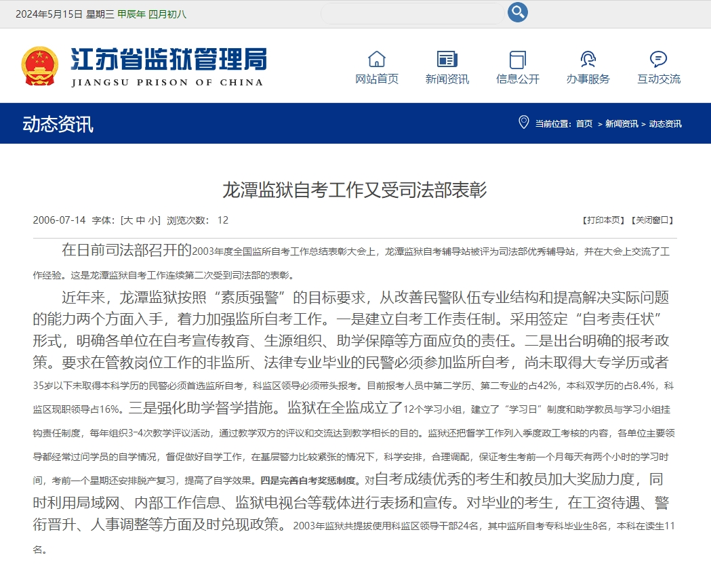
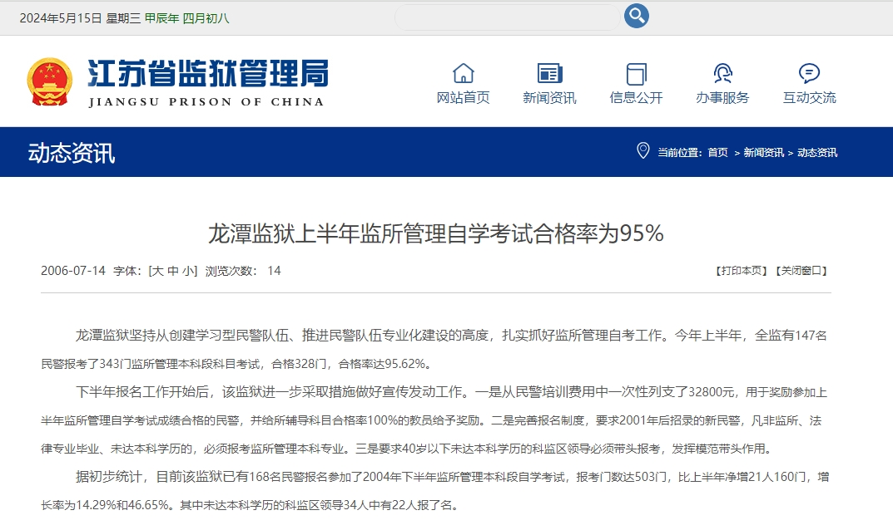
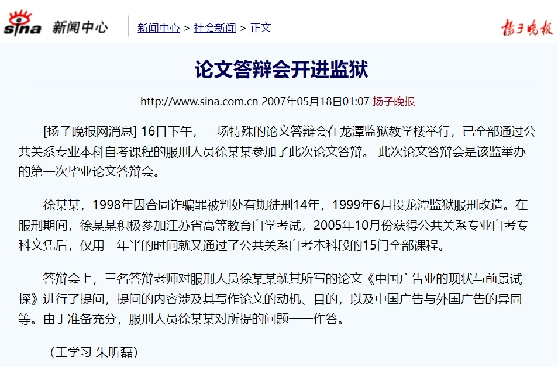
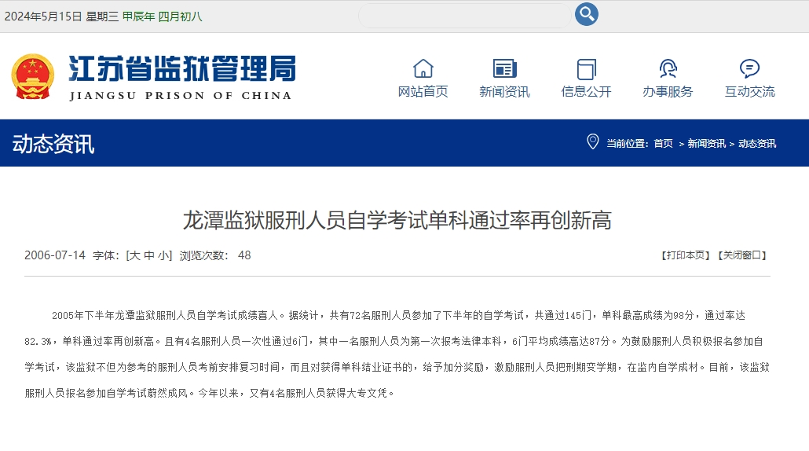
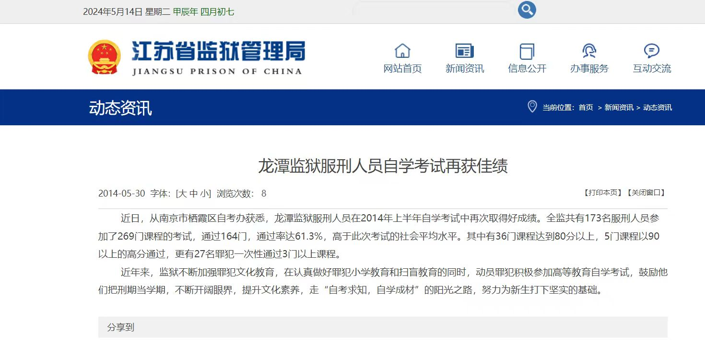
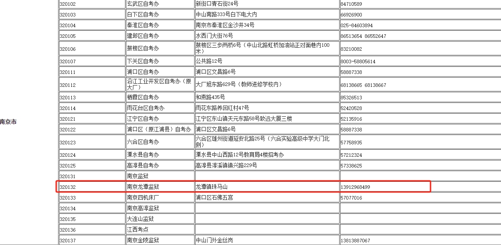

##### 【社会自考】2024年春社会自考论文成绩公示

[!官网地址链接](https://jjy.njau.edu.cn/info/1193/6374.htm)

##### 工商管理专业学位证含金量世界第一，遥遥领先！

1. 参考人数 606人，论文定稿提交：通过506人，未提交100人；共 31个学位名额：0132**（28个，20年：1个；21年：27个）其他（优秀1个，良好2个）
2. 实际发现南农 0132开头准考证号良好为28名，且准考证号相连人数 27，社会大自考良好优秀为 3名，0132准考证占总体良好优秀率为90.32%。同时调查发现0132为南京龙潭监狱自考点，龙潭监狱曾多次因自考工作获得司法表彰。
3. 论文指导资源倾斜，论文指导教育校内外不公平，社会大自考全程拖延，存在写作全程长达十几天不批阅，不给予有效指导的问题。
4. 占据社会大自考学校坑位却不承担论文辅导等社会责任，论文批阅流水式操作。
5. 教务处评定标准不规范，执行不全。校内外针对 0132准考证及其他准考证号双重评判，区别对待，等级方面不存在多方评定打分，缺乏公平
6. 答辩过程不规范甚至违规，线上答辩仅1名答辩老师参加会议，未执行有效监督，保证公平。

##### 南京龙潭监狱

[!龙潭监狱自考工作又受司法部表彰](https://jssjyglj.jiangsu.gov.cn/art/2006/7/14/art_48197_3708615.html)

[!龙潭监狱上半年监所管理自学考试合格率为95%](https://jssjyglj.jiangsu.gov.cn/art/2006/7/14/art_48197_3708442.html)

[!论文答辩会开进监狱](https://news.sina.com.cn/s/2007-05-18/010711841040s.shtml)

[!龙潭监狱服刑人员自学考试单科通过率再创新高](https://jssjyglj.jiangsu.gov.cn/art/2006/7/14/art_48197_3707808.html)

##### 江苏各自考办报名地址及联系电话一览表

[!江苏各自考办报名地址及联系电话一览表](https://m.jszikao.com.cn/question/a24566.html)

